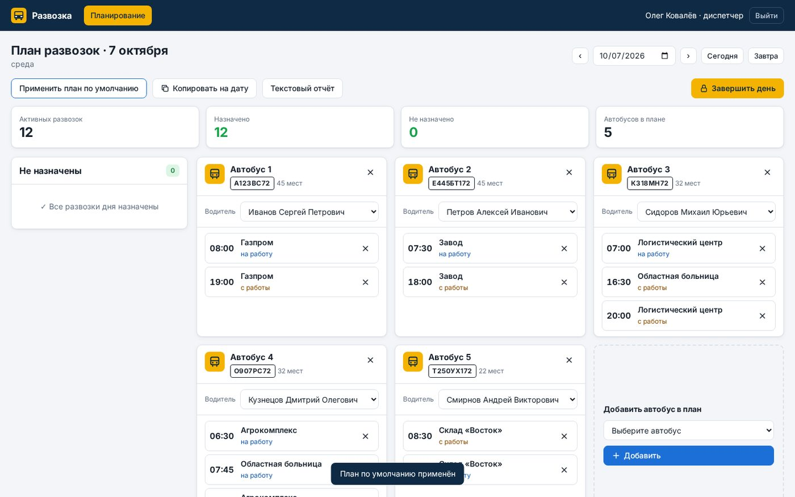
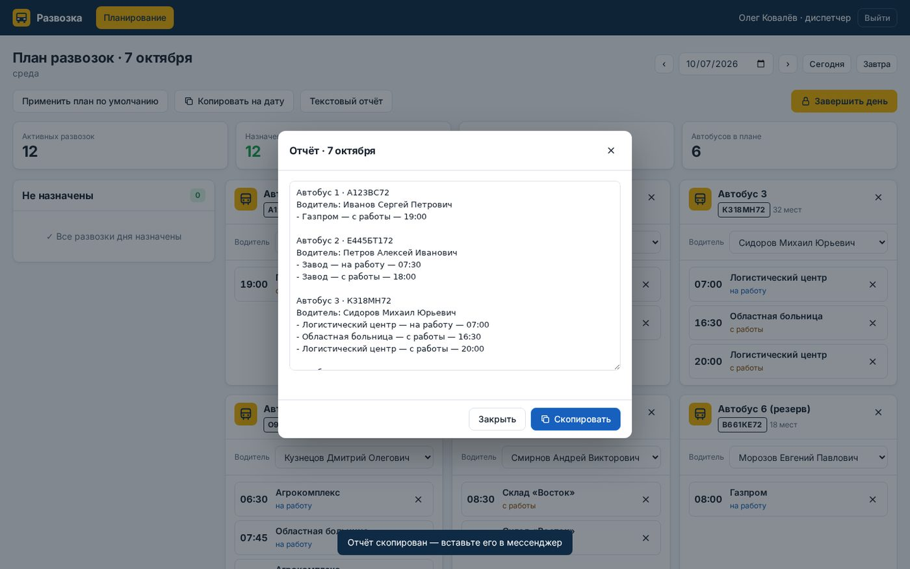
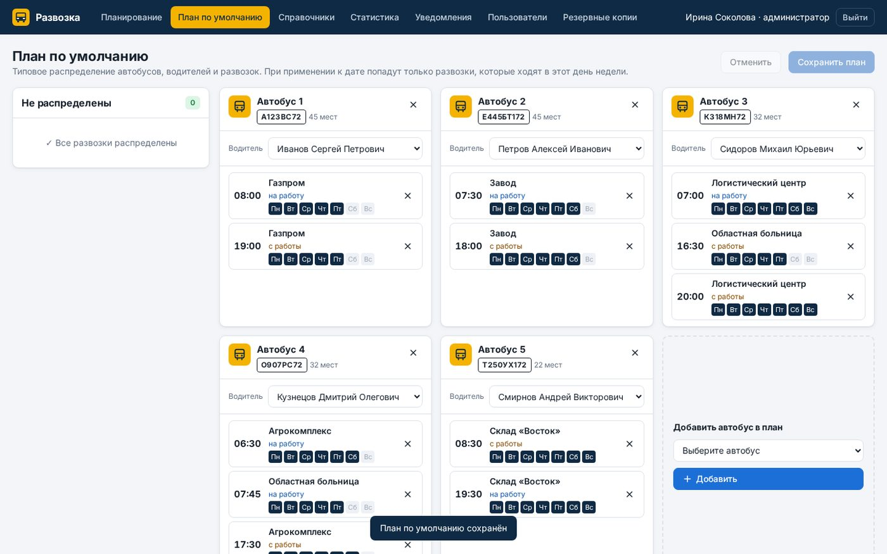
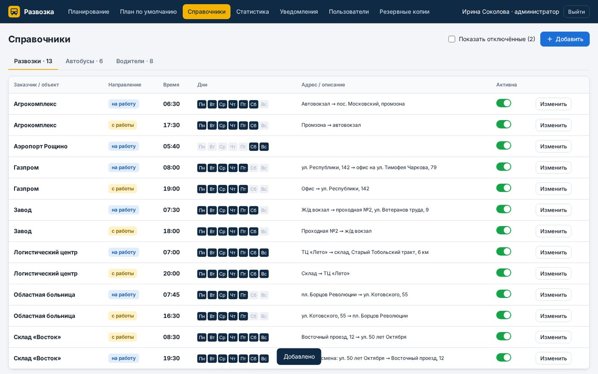
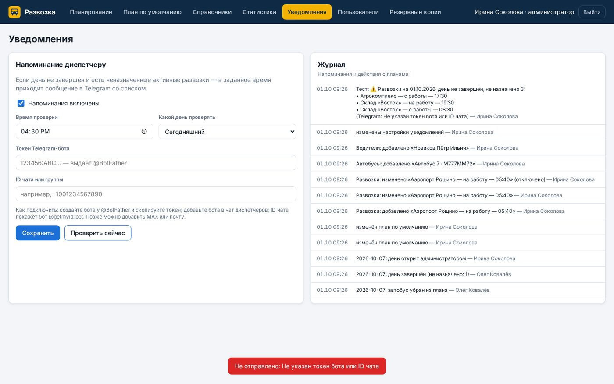
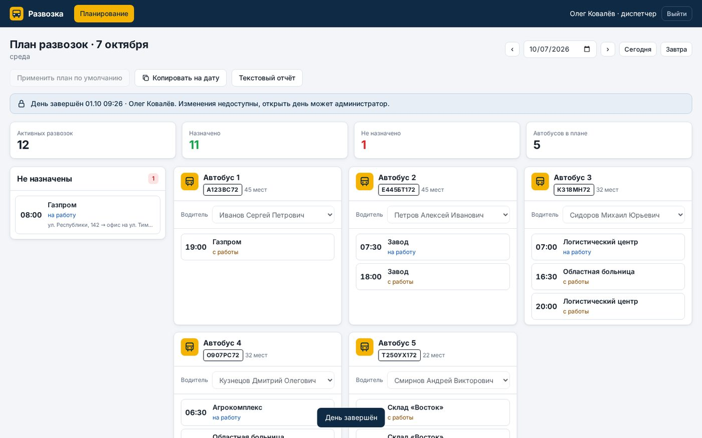
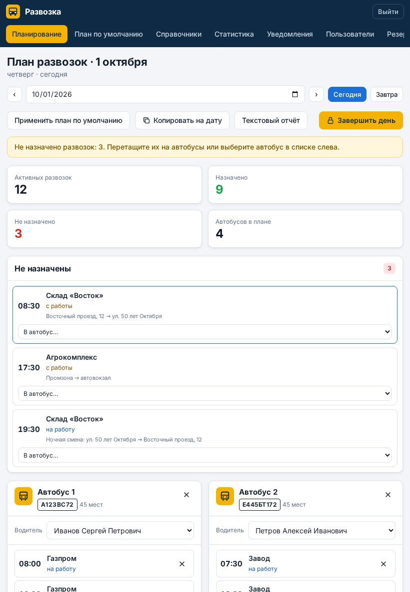

# Развозка — веб-сервис диспетчера развозок

Диспетчер каждый день собирает план развозки сотрудников — какие автобусы выходят, кто за рулём и какие рейсы они везут — вместо таблицы в Excel.
MVP по реальному заказу с FL.ru («Веб-сервис для автоматизации диспетчеризации развозок»).

**Демо:** https://razvozki-permyakov-sergey.amvera.io (Amvera, данные в постоянном хранилище). Пароль у всех демо-пользователей: `razvozka`.

| Логин | Роль | Что видит |
|---|---|---|
| `admin` | Администратор | всё: планирование, план по умолчанию, справочники, статистика, уведомления, пользователи, резервные копии |
| `dispatcher` | Диспетчер | только рабочий план на дату: назначение развозок, отчёт, завершение дня |



## Для кого и какую задачу решает

**Пользователь:** диспетчер и руководитель транспортной службы, которая возит сотрудников заказчиков (заводы, склады, больницы) на работу и с работы.
**Боль:** план на каждый день собирают вручную в Excel: легко забыть рейс, поставить одного водителя на два автобуса
или две развозки на одно время; отчёт для водителей перепечатывают в мессенджер руками, а статистику выездов приходится считать отдельно.
**Решение:** один экран планирования с подсказками об ошибках, типовой план одной кнопкой, готовый текстовый отчёт,
завершение дня с защитой от правок, статистика и напоминание в Telegram, если на завтра что-то не назначено.

## Что умеет

- **Вход и роли.** Логин и пароль, две роли; права проверяются на сервере — диспетчер не попадёт в админ-разделы даже по прямому запросу.
- **Планирование на дату.** Активные развозки дня берутся по расписанию дней недели. Автобусы в плане, смена водителя,
  назначение развозок перетаскиванием мышью или из списка, удаление автобуса и развозки из плана.
  Подсказки: не назначено, автобус без водителя, две развозки в одно время, водитель уже занят в другом автобусе.
- **План по умолчанию.** Типовая расстановка применяется к дате одной кнопкой — подставляются только развозки этого дня недели.
- **Копирование плана** на другую дату и **завершение дня**: закрытый день нельзя изменить, открыть его может только администратор.
- **Текстовый отчёт** дня в формате из ТЗ — копируется в мессенджер одной кнопкой.
- **Справочники:** развозки (заказчик, направление «на работу / с работы», время, дни недели, адрес), автобусы (госномер, мест,
  водитель по умолчанию), водители. Записи не удаляются, а отключаются — история и статистика сохраняются.
- **Статистика** выездов по автобусам, водителям и развозкам за период — только по завершённым дням или по всем.
- **Уведомления.** В заданное время, если день не завершён и есть неназначенные развозки, приходит сообщение в Telegram
  со списком; журнал напоминаний и всех действий с планами.
- **Пользователи:** создание, роль, отключение, смена пароля.
- **Резервные копии:** ежедневные автокопии (14 последних), скачивание и восстановление из файла.
- **Адаптивность:** рассчитан на ПК, корректно работает на ноутбуке и планшете.

## Стек

Node.js 18+ без внешних зависимостей (встроенный HTTP-сервер, хранение в JSON-файле с автокопиями, пароли — scrypt),
интерфейс — HTML/CSS/JavaScript без фреймворков, Telegram Bot API, деплой — Amvera (хранилище `/data`).

## Скриншоты

| Планирование дня | Текстовый отчёт |
|---|---|
|  |  |
| **План по умолчанию** | **Справочник развозок** |
|  |  |
| **Статистика** | **Уведомления и журнал** |
|  |  |
| **Завершённый день** | **Планшет** |
|  |  |

## Запуск

Нужен Node.js 18+. Внешних зависимостей нет, `npm install` не требуется.

```bash
npm start        # http://localhost:3000
```

При первом запуске создаются демо-данные: 12 развозок, 6 автобусов, 7 водителей, план по умолчанию и 30 завершённых дней для статистики
(все имена и телефоны вымышленные).

Переменные окружения:

- `PORT` — порт, по умолчанию 3000;
- `DATA_DIR` — где хранить базу `db.json` и автокопии `backups/` (по умолчанию `/data`, если такая папка есть, иначе `./data`);
- `TZ_OFFSET_HOURS` — часовой пояс заказчика, по умолчанию 5 (Тюмень/Екатеринбург).

### Telegram-напоминания

Администратор в разделе «Уведомления» указывает токен бота (выдаёт @BotFather) и ID чата диспетчеров, время проверки
и какой день проверять (сегодня или завтра). Кнопка «Проверить сейчас» отправляет тестовое сообщение.

### Публикация на Amvera

Файл `amvera.yaml` уже в репозитории: окружение Node 20, команда `npm start`, порт 3000, постоянное хранилище `/data`.
Достаточно `git push` в репозиторий проекта Amvera.

## Разработка — вайб-кодинг в Claude Code

Сервис собран поэтапно в Claude Code по ТЗ заказчика: сервер и модель данных → интерфейс → проверки сценариев и оформление.
Зеркало репозитория: https://gitverse.ru/permyakov-sergey/razvozka
