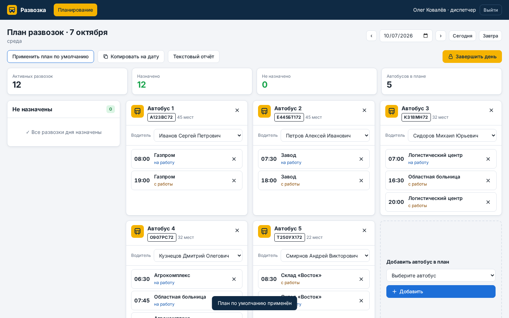
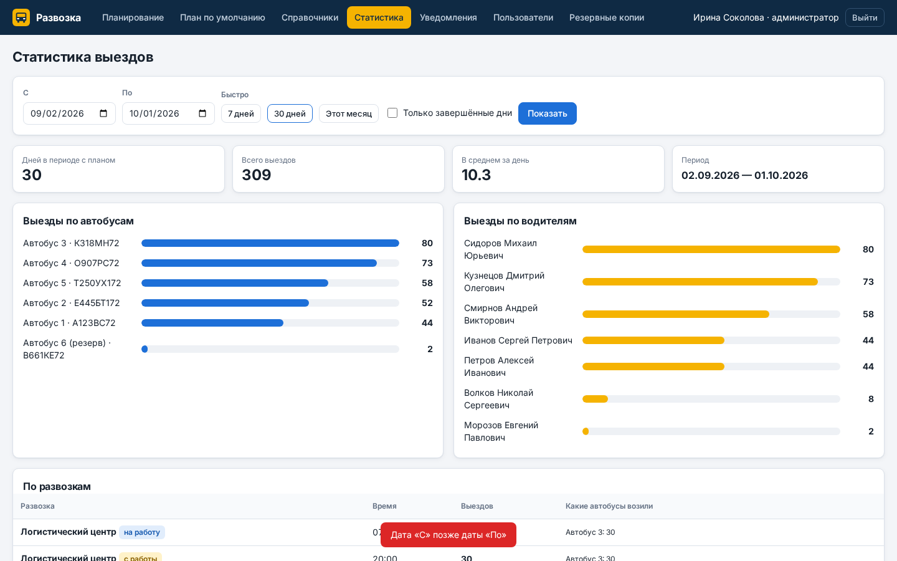

# Развозка — веб-сервис диспетчера развозок

MVP по заказу с FL.ru «Веб-сервис для автоматизации диспетчеризации развозок»: вместо Excel диспетчер
каждый день собирает план — какие автобусы выходят, кто за рулём и какие развозки они везут.



## Что умеет

- **Вход по логину и паролю**, две роли: администратор видит всё, диспетчер — только рабочий план.
- **Планирование на дату**: активные развозки дня (по расписанию дней недели), автобусы в плане,
  назначение развозок перетаскиванием или из списка, смена водителя, удаление автобуса и развозки.
  Подсказки: не назначено, автобус без водителя, две развозки в одно время, водитель занят в другом автобусе.
- **План по умолчанию**: типовая расстановка, применяется к дате одной кнопкой — берутся только развозки этого дня недели.
- **Копирование плана** на другую дату, **завершение дня** (защита от случайных правок), открыть день может только администратор.
- **Текстовый отчёт** дня в формате из ТЗ — копируется в мессенджер одной кнопкой.
- **Справочники**: развозки (заказчик, направление «на работу / с работы», время, дни недели, адрес), автобусы, водители.
  Записи не удаляются, а отключаются — история и статистика сохраняются.
- **Статистика**: выезды по автобусам, водителям и развозкам за период, только завершённые дни или все.
- **Уведомления**: в заданное время, если день не завершён и есть неназначенные развозки, — сообщение в Telegram
  со списком; журнал напоминаний и действий.
- **Пользователи**: создание, роль, отключение, смена пароля.
- **Резервные копии**: ежедневные автокопии (14 последних), скачивание и восстановление из файла.

## Демо-доступ

Пароль у всех: `razvozka`

| Роль | Логин |
|---|---|
| Администратор | `admin` |
| Диспетчер | `dispatcher` |

## Запуск

Node.js 18+, внешних зависимостей нет.

```bash
npm start        # http://localhost:3000
```

Данные — `data/db.json` (на Amvera — постоянное хранилище `/data`), автокопии — `data/backups/`.
Часовой пояс заказчика задаётся переменной `TZ_OFFSET_HOURS` (по умолчанию 5 — Тюмень/Екатеринбург).

## Публикация на Amvera

Файл `amvera.yaml` уже в репозитории: окружение Node 20, команда `npm start`, порт 3000, хранилище `/data`.
Достаточно `git push` в репозиторий проекта Amvera.


